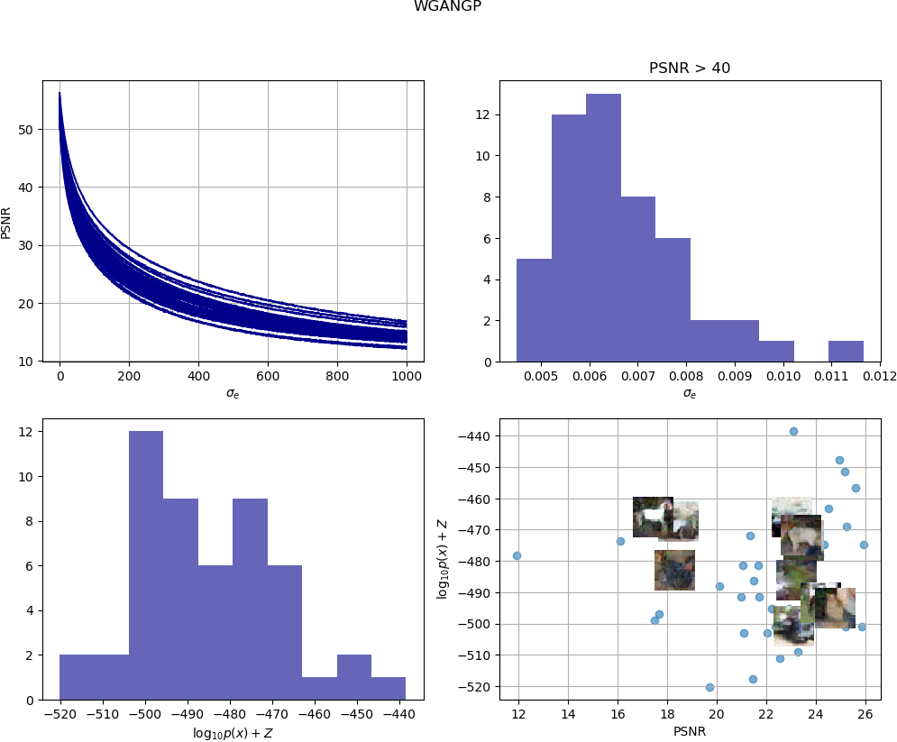

# EvalGAN
Official code for Out-of-Sample Testing for GANs by ....
## Installation

```
git clone hattps://github.com/anonymous/EvalGAN
cd EvalGAN
pip3 install -r requirements.txt
```

Throughout this document we will refer to the generator network as G

## Parameters
Here you may find a description of the parameters of the EvalGAN object:

- `input_G_name`: Placeholder's name of the input noise to G.
- `output_G_name`: Name of the tensor in G holding the generated data.
- `batch_size`:  Batch size of the trained GAN.
- `z_dim`: Dimension of the noise vector.
- `z_init`: Initialization for the noise vector.
- `constraint`: Select constraint to be applied during optimization (Optional)
- `learning_rate`: Initialization for the noise vector.
- `checkpoint_dir`: Path to the trained GAN checkpoint and meta data.
- `output_dir`: Folder to save results.
- `model_name`: Name of the model evaluated using EvalGAN

## Methods of EvalGAN

Here you will find the methods you may need to modify in order to fit your data type. All these methods can be found in `evalGAN.py`

### Normalize/Denormalize data
Be sure that after normalization your data match the format of the
 output of G.
```
def normalize_data(self, data):
    return data

def denormalize_data(self, data):
    if(data.max()< 1.01 and data.min() < -0.01):
        data =  (data+1.)*127.5
    elif(data.max()< 1.01 and data.min() > -0.01):
        data =  (data)*255.

    if(data.shape[-1]>3):
        data = np.transpose(data,(0,2,3,1))
    return data.astype(int)
```

### Quality Metric

Metric to measure how similar are two samples of your dataset. In this example we show the Peak SNR (PSNR) that can be used for images. Please notice this method receives two arrays with shape [n_samples,...]
```
def dist(self, x_test, x_recons):
    mse = np.mean((x_test-x_recons)**2, (1,2,3))
    return 10*np.log10(255**2/mse)
```

The following measure select the loss function to use during optimization. Notice it receives two tensors.


```
def loss_function(self, x_real, x_recons):
    return tf.reduce_mean(tf.reduce_sum(tf.square(x_real - x_recons),[1,2,3]))
```


## Usage example with Images
NOTE: the use of GPU is recommended.


First you need to load your n samples in a numpy array
```
x_test = get_your_data() # shape: [n,h,w,c]
```

Then, fill the necessary parameters to locate your trained GAN, identify the input (plus its dimension) and output  tensors of G,... This is a possible configuration

```
z_dim=256
evalGAN = EvalGAN(input_G_name='z',
                  output_G_name='generator/out:0',
                  batch_size=64,
                  z_dim=z_dim,
                  z_init=tf.initializers.random_normal(0.,1.),
                  constraint=lambda t: tf.clip_by_norm(t,  np.sqrt(z_dim)),
                  learning_rate=5e-3,
                  beta1=0.9,
                  checkpoint_dir='./checkpoint_folder',
                  output_dir='./result_folder',
                  model_name='GAN')
```

Then load the samples in which you want to evaluate the GAN and set any additional placeholder your network may need

```
evalGAN.set_data(x_test)
evalGAN.add_placeholder('Placeholder1', False)
evalGAN.add_placeholder('Placeholder2', 0.5)
```
Now, we are ready to solve the optimization problem to find the best reconstruction and its associated input vector. Be aware this is an optimization per samples.
```
evalGAN.fit(epochs=3, early_stopping=1, restore=1)
```

To obtain the estimated sample loglikelihood, select the range of sigma, that is the region around the inferred input noise, you would like to explore. For the non-isotropic approximation select the maximum number of noise samples to consider and a choose threshold to ensure that two samples are indistinguishable. In this example, we select as T a PSNR=40.

```
sigma_list = np.linspace(0.001,0.2,100)

evalGAN.analysis_isotropic(sigma_list, N=128)
evalGAN.analysis_non_isotropic( sigma_list, N=1000,N_max=10000, T=40)
```

We get the results with

```
evalGAN.print_results() # Returns the PSNR and ll per sample
f = evalGAN_SN.plot()
```

We can compare the EvalGAN scatter plot of several models as follows

```
data_SN = evalGAN_SN.get_scatter_data()
data_GP = evalGAN_GP.get_scatter_data()

utils.plot_scatter(data_SN, ax, label=evalGAN_SN.model_name)
utils.plot_scatter(data_GP, ax, label=evalGAN_GP.model_name)

utils.save_fig(f,'evalGAN_scatter.png', latex=False)
```

## Toy Example Results
We have trained the SNDCGAN and WGANGP with CIFAR10 and used 50 test samples with EvalGAN.





```
              SNDCGAN                
--------------------------------
Samples       |  PSNR  |  LL(x)
Sample(0/50)  |  22.0  |  -459.97
Sample(1/50)  |  23.3  |  -486.07
Sample(2/50)  |  25.9  |  -432.07
Sample(3/50)  |  24.9  |  -428.88
Sample(4/50)  |  23.3  |  -471.4
Sample(5/50)  |  26.1  |  -434.18
```

## Built With

* [TensorFlow](https://www.tensorflow.org/) - Open source software library for numerical computation using data-flow graphs
* [Python 3.6.4](https://www.python.org/downloads/release/python-364/) - Dependency Management

<!--
## Authors

* **Anonymous**

See also the list of [contributors](https://github.com/your/project/contributors) who participated in this project.

## License

This project is licensed under the MIT License - see the [LICENSE.md](LICENSE.md) file for details

## Acknowledgments

* Hat tip to anyone whose code was used
* Inspiration
* etc -->
